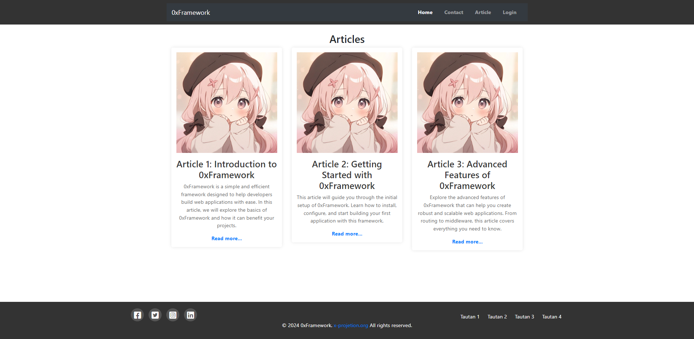

# 0xFramework

0xFramework is a lightweight and efficient web application framework designed to simplify web development. With a focus on performance and ease of use, 0xFramework provides a comprehensive set of features that help developers build scalable and maintainable web applications.

## Key Features

- **Flexible Routing:** Easily define routes and navigate through web applications.
- **Request Management:** Manage HTTP requests effortlessly to process user input and return appropriate responses.
- **Template Support:** Provides a templating system to separate logic from presentation, enhancing code clarity and maintenance.
- **Integrated Security:** Includes built-in security features to protect applications from common attacks like SQL injection and XSS (Cross-Site Scripting).
- **Comprehensive Documentation:** Comes with extensive documentation to assist developers in getting started and understanding key concepts of the framework.

## Why Choose 0xFramework?

- **Modular Design:** Allows developers to focus more on business logic rather than basic infrastructure setup.
- **User-Friendly:** Designed for both beginners and experienced developers seeking a lightweight yet powerful framework for modern web application development.
- **Scalability:** Enables rapid development of scalable applications, adapting to project requirements effectively.

## Getting Started

To get started with 0xFramework, clone the repository and follow the installation instructions in the [documentation](link-to-documentation).
